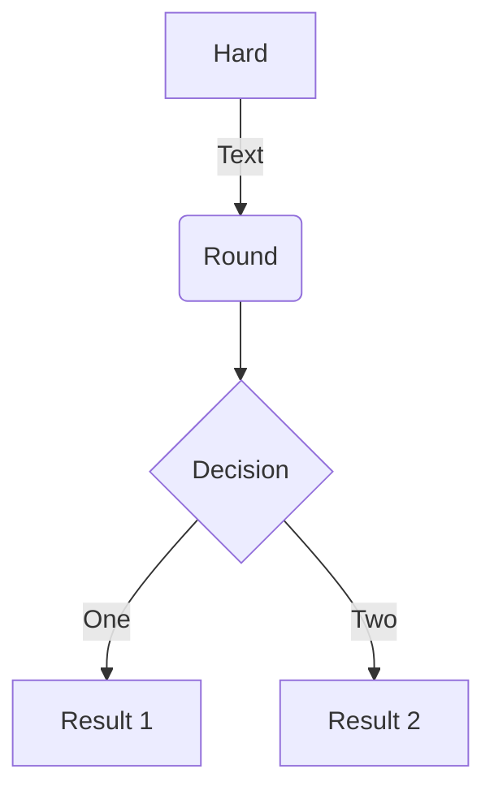

# documentation using markup language
Goal: Automate csv data from access analysis and visualize the plot

```mermaid

graph TD
A[Hard] -->|Text| B(Round)
B --> C{Decision}
C -->|One| D[Result 1]
C -->|Two| E[Result 2]

```
